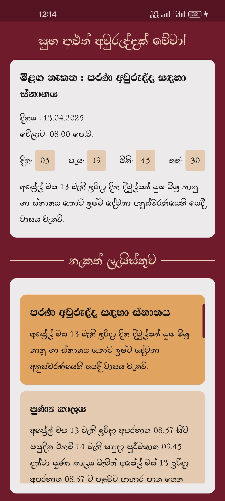
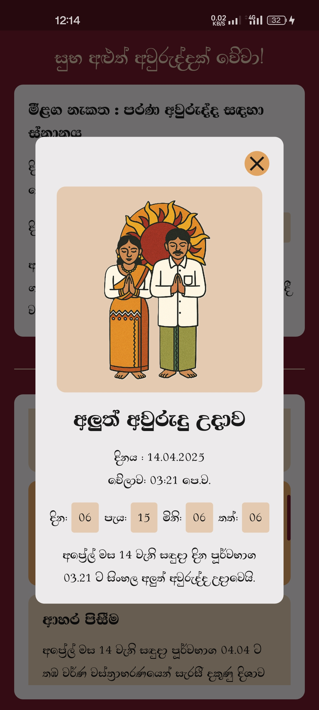
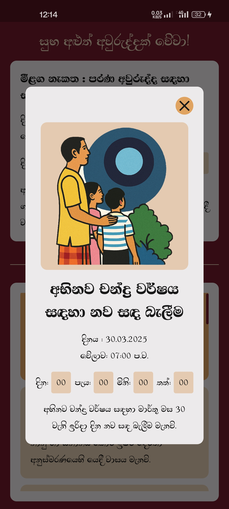

# 🎉 Avurudu Nakath App

A Flutter-based mobile app to celebrate and track **Sinhala & Tamil New Year (Aluth Avurudu)** auspicious times with a beautiful, real-time dashboard and culturally inspired design.

---

## 📱 About the App

**Avurudu Nakath** is designed to help users stay connected to Sri Lankan New Year traditions by providing real-time countdowns, event descriptions, and a localized experience with Sinhala support.

---

## ✨ Features

- 🕒 Countdown timers for each auspicious time
- 📅 Dynamic event dashboard
- 📲 Fully responsive layout across mobile devices
- 🧩 Modular architecture for easy scalability and maintenance

---

## 🛠 Tech Stack

- **Framework:** Flutter & Dart
- **State Management:** `StatefulWidget` + `Timer`

---

## 📸 Screenshots

| Home Screen | Dashboard | 
|-------------|-----------|
|  |  |

| Event | Event |
|-------|-------|
|  |  |

---

## 📥 Download

You can download the latest APK from the GitHub Releases page:

👉 [**Download Avurudu Nakath APK**](https://github.com/gunathilakax/avurudu_nakath/releases/download/v1.0.0/avurudu_nakath.apk)

> Make sure to enable installation from unknown sources on your Android device.

---

## Getting Started

This project is a starting point for a Flutter application.

A few resources to get you started if this is your first Flutter project:

- [Lab: Write your first Flutter app](https://docs.flutter.dev/get-started/codelab)
- [Cookbook: Useful Flutter samples](https://docs.flutter.dev/cookbook)

For help getting started with Flutter development, view the
[online documentation](https://docs.flutter.dev/), which offers tutorials,
samples, guidance on mobile development, and a full API reference.
